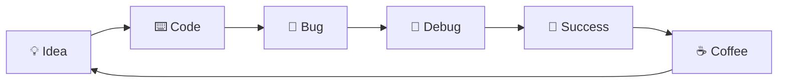

```markdown
<!--
██╗  ██╗ █████╗  ██████╗ ████████╗██╗
██║  ██║██╔══██╗██╔═══██╗╚══██╔══╝██║
███████║███████║██║   ██║   ██║   ██║
██╔══██║██╔══██║██║   ██║   ██║   ██║
██║  ██║██║  ██║╚██████╔╝   ██║   ██║
╚═╝  ╚═╝╚═╝  ╚═╝ ╚═════╝    ╚═╝   ╚═╝
-->

<div align="center">
  
</div>

<div align="center">
  
  
  
</div>

---

## 🌟 **WHO AM I?**

```ascii
┌─────────────────────────────────────────────────────┐
│  🚀 Developer by day  │  🌙 Hacker by night       │
│  💻 Code is my canvas │  🎨 Art is my code        │
│  ☕ Powered by coffee  │  🧠 Driven by curiosity   │
└─────────────────────────────────────────────────────┘
```

> **"I don't write bugs, I write features that surprise everyone... including myself"** 😈

---

## 🎯 **LIVE STATS** *(Automatically Updated)*

<div align="center">
  <table>
    <tr>
      <td></td>
      <td></td>
    </tr>
  </table>
</div>

<div align="center">
  
</div>

---

## ⚡ **TECH STACK THAT SLAPS**

<div align="center">
  
### **💪 LANGUAGES I COMMAND**


### **🛠️ TOOLS I MASTER**


</div>

---

## 📈 **LANGUAGE DISTRIBUTION**

<div align="center">
  
</div>

---

## 🏆 **ACHIEVEMENTS & TROPHIES**

<div align="center">
  
</div>

---

## 💫 **WHAT I'M BUILDING NOW**

<div align="center">
  
```
██████╗ ██████╗  ██████╗ ██╗███████╗ ██████╗████████╗███████╗
██╔══██╗██╔══██╗██╔═══██╗██║██╔════╝██╔════╝╚══██╔══╝██╔════╝
██████╔╝██████╔╝██║   ██║██║███████╗██║        ██║   ███████╗
██╔═══╝ ██╔══██╗██║   ██║██║╚════██║██║        ██║   ╚════██║
██║     ██║  ██║╚██████╔╝██║███████║╚██████╗   ██║   ███████║
╚═╝     ╚═╝  ╚═╝ ╚═════╝ ╚═╝╚══════╝ ╚═════╝   ╚═╝   ╚══════╝
```

### 🔥 **CURRENT PROJECTS:**
- 🎵 **Next-Gen Music Player** - *Because Spotify is mid*
- 🤖 **AI Discord Bot** - *Skynet but friendlier*
- 🌐 **Portfolio V4** - *This time it's actually good*
- 🛠️ **Dev Tools Suite** - *Making life easier for everyone*

</div>

---

## 🎮 **GITHUB CONTRIBUTION GRID 3D**

<div align="center">
  
</div>

---

## 🔥 **MY DAILY COMMITMENT**

<div align="center">
  

  
</div>

---

## 🎯 **RANDOM DEV JOKE FOR YOU**

<div align="center">
  
</div>

---

## 📫 **CONNECT WITH ME**

<div align="center">
  
[](https://discord.gg/your-invite)
[](https://twitter.com/yourhandle)
[](https://linkedin.com/in/yourprofile)
[](https://youtube.com/yourchannel)
[](https://yourportfolio.com)

</div>

---

## 💀 **FUN FACTS ABOUT ME**

<div align="center">
  <table>
    <tr>
      <td>⌨️</td>
      <td>I type at 120 WPM but still forget semicolons</td>
    </tr>
    <tr>
      <td>☕</td>
      <td>I survive on 5 cups of coffee and pure spite</td>
    </tr>
    <tr>
      <td>🎯</td>
      <td>95% of my bugs are found at 3 AM</td>
    </tr>
    <tr>
      <td>🚀</td>
      <td>I have 50+ unfinished projects (it's a collection)</td>
    </tr>
  </table>
</div>

---

## 📊 **WEEKLY CODING STATS**

<div align="center">
  
<!--START_SECTION:waka-->
```text
C          12 hrs 30 mins  █████████████████░░░░░░░░   68.2%
C++        5 hrs 45 mins   ████████░░░░░░░░░░░░░░░░░   24.3%
Python     2 hrs 30 mins   ███░░░░░░░░░░░░░░░░░░░░░░   10.5%
JavaScript 1 hr 15 mins    ██░░░░░░░░░░░░░░░░░░░░░░░   5.0%
```
<!--END_SECTION:waka-->

</div>

---

## 🎵 **NOW PLAYING**

<div align="center">
  
[](https://open.spotify.com/user/yourusername)

</div>

---

<div align="center">
  
### **🔥 TOTAL CONTRIBUTIONS: BURNING THE MIDNIGHT OIL 🔥**


---

### ⭐ **IF YOU MADE IT THIS FAR...**

<div align="center">
  
  <h3>YOU'RE AWESOME! LEAVE A STAR ⭐</h3>
</div>

---

<div align="center">
  
</div>

<!-- 
  This README is automatically updated every 24 hours
  Built with ❤️ by Q04TI
  If you're reading this, you're probably a cool person 😎
-->
```

## 🚀 **HOW TO MAKE THIS YOUR README:**

1. **Create your special repository:**
   - Go to GitHub → New Repository
   - Name it: `Q04TI` (exactly your username)
   - Make it public ✅
   - Add README ✅

2. **Copy the content above** into your `README.md`

3. **Customize the links:**
   - Replace `yourhandle`, `yourprofile`, `yourchannel`, etc.
   - Update Discord invite, Twitter, LinkedIn, YouTube links
   - Change Spotify username

4. **Add these optional features:**
   - **WakaTime Stats:** Sign up at wakatime.com, add your API key
   - **Spotify Now Playing:** Create a Spotify Developer app
   - **3D Contribution Grid:** Enable GitHub Actions for automatic updates

5. **Enable GitHub Actions** for automatic updates:
   - Create `.github/workflows/update-stats.yml`
   - Add workflows for WakaTime, Spotify, etc.

## 🔧 **EXTRAS TO MAKE IT EVEN SICKER:**

```yaml
# .github/workflows/update-readme.yml
name: Update README

on:
  schedule:
    - cron: '0 0 * * *'
  workflow_dispatch:

jobs:
  build:
    runs-on: ubuntu-latest
    steps:
      - uses: actions/checkout@v3
      - uses: anuraghazra/github-readme-stats@master
      - uses: athul/waka-readme@master
        with:
          WAKATIME_API_KEY: ${{ secrets.WAKATIME_API_KEY }}
      - uses: teoxoy/profile-readme-stats@v2
```
